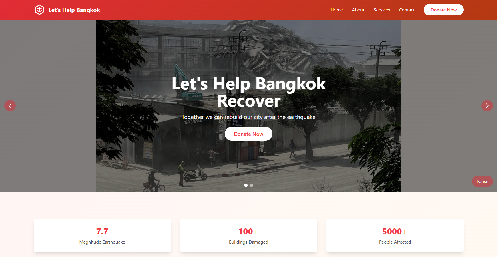

# 🌍 Let's Help Bangkok

A responsive web application dedicated to supporting Bangkok's earthquake recovery efforts through community engagement and emergency response coordination.

[](https://lets-help-bangkok.onrender.com)
[](https://reactjs.org)
[](https://www.typescriptlang.org)
[](https://tailwindcss.com)

## 📱 Preview

<div align="center">
  
</div>

## 🚀 Features

- **Responsive Design**: Fully responsive layout that works on all devices
- **Interactive UI**: Modern and intuitive user interface
- **Multi-language Support**: Available in both English and Thai
- **Accessibility**: WCAG compliant design
- **Performance Optimized**: Fast loading and smooth transitions

## 🛠️ Tech Stack

- **Frontend**: React 18, TypeScript, Tailwind CSS
- **Routing**: React Router v6
- **State Management**: React Context API
- **Deployment**: Render
- **Code Quality**: ESLint, Prettier

## 📋 Pages

1. **Home**: Overview of the initiative and emergency updates
2. **About**: Mission, timeline, and team information
3. **Services**: Available support services and resources
4. **Contact**: Multiple contact methods and inquiry form
5. **Donate**: Secure donation platform with multiple payment options

## 🚨 Important Notice

This is a demonstration website created to showcase the potential of a disaster response platform. Please note:
- All contact information is for demonstration purposes only
- No actual donations or personal information should be submitted
- For real inquiries, please contact: hdreamdev@gmail.com

## 🛠️ Installation

1. Clone the repository:
   ```bash
   git clone https://github.com/yourusername/lets-help-bangkok.git
   ```

2. Install dependencies:
   ```bash
   cd lets-help-bangkok
   npm install
   ```

3. Start the development server:
   ```bash
   npm run dev
   ```

4. Open [http://localhost:5173](http://localhost:5173) in your browser

## 🤝 Contributing

Contributions are welcome! Please feel free to submit a Pull Request.

## 📝 License

This project is licensed under the MIT License - see the [LICENSE](LICENSE) file for details.

## 👨‍💻 Developer

**Rowell Camero**  
Full Stack Developer

- [Portfolio](https://rowell-camero-portfolio.onrender.com/)
- [LinkedIn](https://linkedin.com/in/rowell-camero-67b868249)

## 🙏 Acknowledgments

- Emergency Response Teams
- Community Volunteers
- Open Source Community
- All contributors and supporters

---

<div align="center">
  <p>Made with ❤️ for Bangkok</p>
  <p>© {new Date().getFullYear()} Let's Help Bangkok. All rights reserved.</p>
</div>
